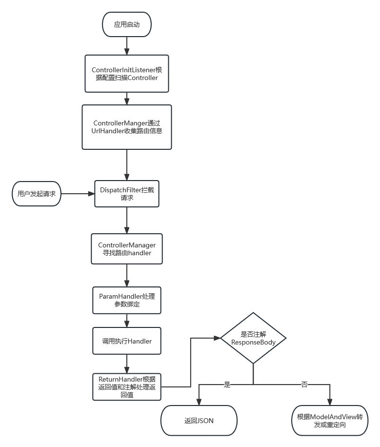

# 项目由来
大二下学期javaweb课程老师不允许使用ssm完成课程设计，由于自己学习了ssm以及kotlin
觉得kotlin语法糖比较方便，同时也在学习的过程中不断思考ssm的功能如何实现，于是
根据自己所学的java知识以及查阅kotlin文档按照自己的思路完成了一个简版的mybatis和
springmvc.
# 项目结构
- Annotations
各个模块定义的注解
- ButterDao
实现简单Mybatis功能
- ButterDaoSample
ButterDao使用示例
- Commons
工具类
- mineMvc
实现简单类似SpringMvc功能
- homework
使用框架实现的期末作业，尝试使用DDD
# 项目功能
## ButterDao
### 数据库连接池加载(自己实现的连接池)
通过web.xml配置JDBCListener并配置参数在启动时根据参数创建连接池
### 底层增删改查实现
通过DataBaseHelper抽象增删改查基础能力，并通过NormalDataBaseHelperImpl实现
### 实现类型转换的处理
通过TypeHandler与TypeConverter接口定义类型转换器逻辑，ButterDao通过DefaultTypeHandler来实现jdbctype和javatype的转换
### 实现基于注解的动态SQL以及结果映射
通过方法上的Delete、Insert、Select、Update注解提供SQL以及SQL类型，通过Result注解提供参数映射
### Mapper接口动态代理(实现#{}和${}表达式解析)
通过DaoDelegateHandler对Mapper接口进行动态代理，从而调用DataBaseHelper进行增删改查。
其中需要对参数结果进行适配，同时要从Mapper接口中获取对应的动态SQL，因此抽象出SQLHandler来获取SQL,
抽象ResultSetHandler来处理结果集，抽象ParamHandler来处理动态SQL解析，解析`#{}`和`${}`并从上下文中获取数据填入。
对于`#{}`将替换成`?`占位符并建立参数映射，在PreparedStatement设置参数。
### 实现插入自增id的获取
通过Mapper接口参数传入GenerateKey类型会自动从数据库中查出上一次插入的数据的id并赋值给key属性
### 整体流程
1. 定义Mapper接口
2. 通过SqlSessionFactory创建SqlSession
3. 通过SqlSession.open代理Mapper接口获得实例
4. 通过Mapper接口调用对应方法执行SQL
5. 通过SQL处理器获取SQL
6. 通过参数处理器解析动态参数并获取参数映射
7. 调用DatabaseHelper方法执行底层增删改查
8. 对于查询使用ResultSetHandler根据方法注解实现参数映射
## mineMvc
### Controller扫描
通过web.xml配置扫描包以及监听器即可进行Controller的包扫描，扫描后会将路由映射进行保存
```xml
<context-param>
    <param-name>Controllers</param-name>
    <param-value>com.xxc.homework.controller</param-value>
</context-param>

<listener>
    <listener-class>com.xxc.mvc.listener.ControllerInitListener</listener-class>
</listener>


```
### 路由
通过Filter机制实现路由转发,配置DispatchFilter即可，DispatchFilter将会包扫描获得的路由信息进行转发
```
<filter>
    <filter-name>dispatcher</filter-name>
    <filter-class>com.xxc.mvc.filter.DispatchFilter</filter-class>
</filter>
```
### 支持Json和模板渲染
对于注解ResponseBody的方法，ReturnHandler组件将会通过HttpServletRequest返回json格式的数据，
而对于ModelAndView则会根据前缀是`f:`还是`r:`进行重定向和转发，模板渲染是基于JSP进行的转发
### 支持参数注入
通过ParamHandler对handler的方法参数进行解析，并在请求时从上下文(请求以及其他配置)中动态获取参数绑定到对应位置
### 文件上传支持
对于文件上传请求，我们会通过装饰着模式对HttpServletRequest进行装饰，从而内置处理
文件的方法，并抹平文件上传时HttpServletRequest参数获取的差异，具体实现在com.xxc.mvc.request.decorate.FileUploadRequest中。
同时通过抽象MultiFile去隐藏文件上传的细节。
### 整体流程
1. 在web.xml中配置controller包扫描路径以及监听器以及DispatchFilter。
2. mineMvc会通过监听器调用ControllerManager进行包扫描，扫描Controller或者RestController注解的类
然后通过UrlHandler对这些Controller进行方法的扫描，支持对应SpringMvc中的RequestMapping注解
3. 请求到达时会通过DispatchFilter进行请求的分发，从而打到对应的handler方法并通过ParamHandler绑定参数然后执行业务
逻辑，得到返回结果后会通过ReturnHandler处理返回值,其中包含了对ResponseBody和ModelAndView的处理，
用于返回json和渲染页面(满足最基本的两个需求)

